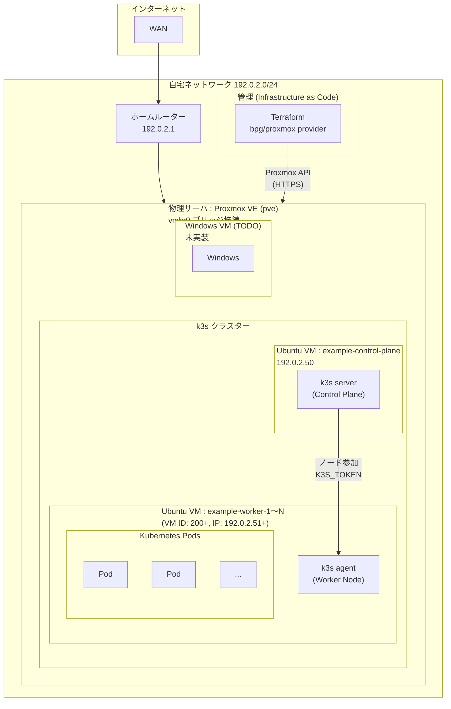
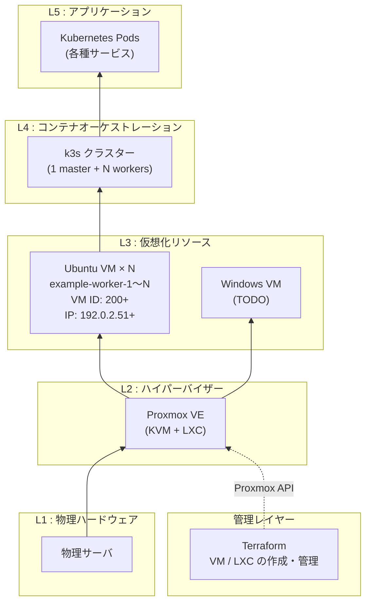

# 自宅サーバ システム構成図

> 公開用サンプル構成です。ドメイン・IP・ノード名は実環境と対応しない例示値へ置換しています。`example.com` と `192.0.2.0/24` は説明用であり、そのまま接続・デプロイできません。構成図は設計例を含み、実環境の状態・安全性を保証しません。

## 全体構成



## レイヤー別構成



## リソース一覧

| 種別 | 名前 | VM ID | IP アドレス | スペック | 用途 |
|------|------|-------|------------|---------|------|
| Ubuntu VM | example-control-plane | - | 192.0.2.50 | - | k3s Control Plane |
| Ubuntu VM | example-worker-1〜N | 200+ | 192.0.2.51+ | 2コア / 2GB / 10GB | k3s Worker |
| Windows VM | (未定) | - | - | - | TODO |

## ネットワーク構成

| 項目 | 値 |
|------|----|
| セグメント | 192.0.2.0/24 |
| ゲートウェイ | 192.0.2.1 |
| Proxmox ブリッジ | vmbr0 |
| k3s Master | 192.0.2.50 |
| k3s Workers | 192.0.2.51〜 |

## IaC 管理構成

```
proxmox_terraform/
├── ubuntu-vm/   # k3s Worker ノード用 Ubuntu VM (Terraform)
└── windows-vm/  # Windows VM (TODO・main.tf 未実装)
```

- **Terraform プロバイダー**: `bpg/proxmox ~> 0.95.0`
- **プロビジョニング**: Cloud-Init (Ubuntu VM) / SSH鍵認証
- **k3s インストール**: `remote-exec` で導入。既存クラスターへのワーカー参加は未実装。
