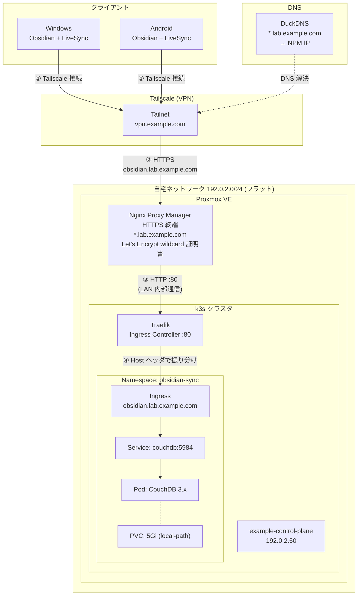

# Obsidian Sync 構成

> 公開用サンプル構成です。ドメイン・IP・ノード名は実環境と対応しない例示値へ置換しています。`example.com` と `192.0.2.0/24` は説明用であり、そのまま接続・デプロイできません。構成図は設計例を含み、実環境の状態・安全性を保証しません。

自宅サーバ + Tailscale + CouchDB で Obsidian Vault を Windows / Android 間で同期する構成。

## 全体アーキテクチャ



## 通信フロー

1. クライアント (Windows / Android) が Tailscale で VPN 接続
2. `https://obsidian.lab.example.com` へリクエスト
   - DuckDNS が NPM の IP を返却（ワイルドカード A レコード）
3. NPM が HTTPS 終端 → 内部 LAN で k3s ノード:80 (HTTP) へ転送
4. Traefik (Ingress Controller) が Host ヘッダを見て CouchDB Service にルーティング
5. Service → CouchDB Pod でデータ永続化

## コンポーネント一覧

| 役割 | 実装 | 配置場所 | 備考 |
|---|---|---|---|
| 同期サーバ | CouchDB 3.x | k3s Pod | StatefulSet, 5GiB local-path PVC |
| Ingress Controller | Traefik | k3s 標準 | Host ヘッダで振り分け |
| HTTPS 終端 / Reverse Proxy | Nginx Proxy Manager | Proxmox VM/LXC | LAN 公開のみ (インターネット非公開) |
| TLS 証明書 | Let's Encrypt wildcard | NPM が管理 | `*.lab.example.com` |
| DNS | DuckDNS | 外部 | ワイルドカード A → NPM IP |
| VPN | Tailscale | 各端末 + k3s ノード | 終端は NPM |
| Obsidian プラグイン | Self-hosted LiveSync (vrtmrz) | 各クライアント | E2E 暗号化必須 |

## 重要な設計判断

### なぜ NPM 経由か（cert-manager を使わない）

- 既存の NPM が `*.lab.example.com` のワイルドカード証明書を持っているため再利用
- この設計例では既存のリバースプロキシで証明書管理を集約する。VPN側の証明書機能・利用条件は導入時に確認する。
- HTTPS 終端を NPM 一元管理にすることで他サービスとも統一

### なぜ Pod に直接 IP を振らないか

- Pod IP は揮発性（再起動で変わる）
- Pod IP は CNI 内部ネットワーク（NPM がいる LAN からは直接到達不可）
- k8s Service が固定の仮想 IP を提供 → Pod の入れ替わりを吸収
- NPM は **k3s ノード IP 1 つ** を知っていれば、サブドメイン振り分けは Traefik に任せる

### なぜ CORS 設定が必要か

CouchDB は別オリジンからのアクセスを CORS でブロックする。Obsidian デスクトップは `app://obsidian.md`、モバイルは `capacitor://localhost` というオリジンで通信するため、これらを許可リストに入れる必要がある (`02-configmap.yaml` 参照)。

## ネットワーク構成

| 項目 | 値 |
|---|---|
| LAN | 192.0.2.0/24 (フラット、サブネット分割なし) |
| Tailscale | vpn.example.com (DuckDNS は NPM IP を返却) |
| 公開ポート (NPM) | 80, 443 (LAN/Tailscale 内のみ) |
| インターネット公開 | **なし** (ルーターのポートフォワード設定なし) |

## セキュリティ

### 効いている対策

- NPMをインターネットへ直接公開しない設計（VPN・LAN・端末侵害などのリスクは残る）
- Tailscale で VPN 認証（リモートアクセスの入口を制御）
- CouchDB 認証（admin パスワード）
- LiveSync E2E 暗号化（サーバ侵害されても Vault 内容は守られる）

### 残存リスクと緩和策

- **LAN フラットによるラテラルムーブメント**: IoT 機器侵害時に内部サービスへ攻撃可能
  - 緩和: k3s ノードに ufw でホストファイアウォール / 強パスワード徹底 / VLAN 対応機器導入を将来検討

## ファイル構成

```
proxmox_terraform/
├── obsidian-sync-architecture.md   # この構成図
├── architecture.md                  # 自宅サーバ全体構成
└── k8s/
    └── obsidian-sync/
        ├── 00-namespace.yaml        # obsidian-sync namespace
        ├── 01-secret.yaml           # CouchDB 認証情報 (.gitignore 対象)
        ├── 02-configmap.yaml        # CouchDB 設定 (CORS 含む)
        ├── 03-statefulset.yaml      # CouchDB 本体 + PVC
        ├── 04-service.yaml          # ClusterIP Service
        └── 05-ingress.yaml          # Traefik Ingress (HTTP)
```

## デプロイ手順

```bash
# k3s ノード上で
kubectl apply -f k8s/obsidian-sync/
```

NPM 側の Proxy Host 設定:

| 項目 | 値 |
|---|---|
| Domain Names | `obsidian.lab.example.com` |
| Scheme | `http` |
| Forward Hostname/IP | `192.0.2.50` (example-control-plane の LAN IP) |
| Forward Port | `80` |
| Websockets Support | **ON** (LiveSync 継続接続のため) |
| SSL | 既存ワイルドカード証明書 + Force SSL ON |

## 運用メモ

- **CouchDB データバックアップ**: `/var/lib/rancher/k3s/storage/...` 配下を定期スナップショット推奨
- **DB compaction**: LiveSync プラグインの「Compact database」を月 1 回程度実行（DB 肥大化対策）
- **証明書更新**: NPM が Let's Encrypt 自動更新を担当
